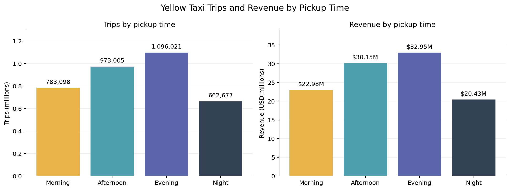
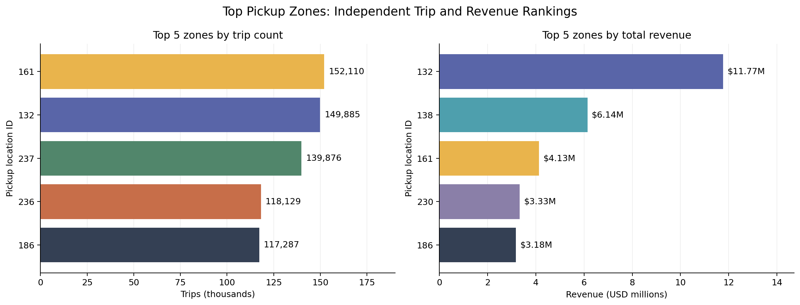
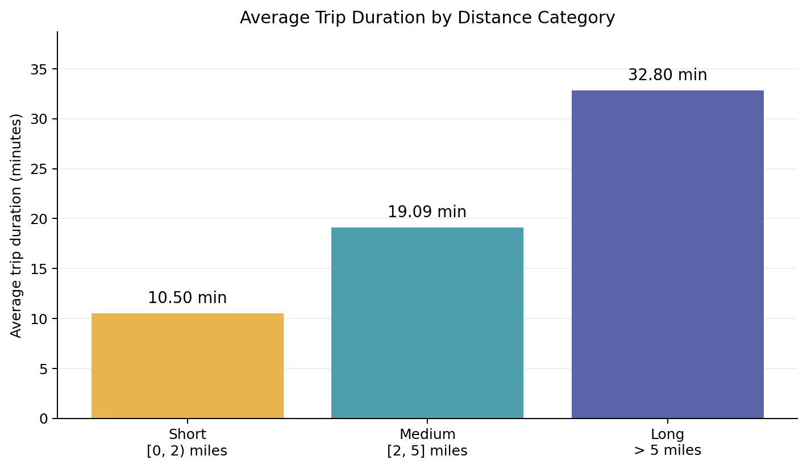

# NYC Yellow Taxi Analytics

A dbt and DuckDB project for the DSCOVR Data Engineering Challenge, using the supplied July 2026 Yellow Taxi dataset.

## Run the project

You need Python and [uv](https://docs.astral.sh/uv/). Run the commands from the repository root.

### 1. Install dependencies

```shell
uv sync --locked
uv run dbt deps
```

### 2. Download the data

Windows PowerShell:

```powershell
New-Item -ItemType Directory -Force data/raw, data/db

Invoke-WebRequest `
    -Uri "https://d37ci6vzurychx.cloudfront.net/trip-data/yellow_tripdata_2026-07.parquet" `
    -OutFile "data/raw/yellow_tripdata_2026-07.parquet"
```

Linux or macOS:

```shell
mkdir -p data/raw data/db
curl -L --fail \
  https://d37ci6vzurychx.cloudfront.net/trip-data/yellow_tripdata_2026-07.parquet \
  -o data/raw/yellow_tripdata_2026-07.parquet
```

### 3. Build and test

```shell
uv run dbt build --profiles-dir .
```

This builds the models and runs the tests. The database is saved to `data/db/yellow_tripdata.duckdb`.

To run only the tests:

```shell
uv run dbt test --profiles-dir .
```

## Project overview

```text
Parquet source
  -> staging_yellow_raw_tripdata
       -> mart_data_quality
       -> staging_yellow_tripdata
            -> mart_trips_by_time_of_day
            -> mart_top_pickup_zones
            -> mart_vendor_rate_performance
            -> mart_distance_analysis
```

The models are in `models/staging`, `models/marts`, and `models/bonus_marts`. Shared rules are in `macros`; test definitions are in the model `schema.yml` files and `tests`.

### Why two staging models?

The first standardizes column names and types and adds `is_valid`, keeping every source row. The second selects valid rows and adds duration, the payment flag, distance category, and time slot. This lets the analytical marts use clean records while the bonus mart can inspect the rejected ones.

### Data-quality rules

`classify_row_data_quality.sql` keeps the validation rules in one place. It marks a row invalid when:

- Distance is null or negative.
- Total amount is null or zero/negative.
- Dropoff is earlier than pickup.

The staging filter uses this flag, so the marts share the same cleaning rules. Zero distance and zero duration are allowed; missing timestamps are checked by tests.

Profiling also identified missing or zero passenger counts and unusually large distances and durations. Passenger counts were retained because they are not used by the required metrics and do not, by themselves, indicate an invalid trip. No upper limits were applied to distance or duration, as the assignment does not define these thresholds. These outliers remain a limitation and can affect the reported averages.

### Shared classifications

`classify_distance` and `classify_time_slots` calculate fields in staging that the marts can reuse. Even though each has one mart consumer today, future models can use the same categories without copying the rules.

Distance categories are short `[0, 2)`, medium `[2, 5]`, and long `> 5` miles. Exactly 2 miles belongs to medium. Time slots follow the assignment: morning 05:00-12:00, afternoon 12:00-17:00, evening 17:00-22:00, and night otherwise. The ending boundary belongs to the next slot.

### Other choices

- Duration is calculated in seconds and converted to minutes, preserving trips shorter than one minute.
- `is_prepaid` follows the assignment's `payment_type = 2` rule. The [TLC dictionary](https://www.nyc.gov/assets/tlc/downloads/pdf/data_dictionary_trip_records_yellow.pdf) calls this code cash, so the flag uses the assignment's convention.
- The pickup-zone mart contains two independent rankings: top five by trips and top five by revenue. Zone ID breaks ties.
- Tip percentage is `avg(tip_amount / total_amount) * 100`, grouped by vendor, as requested.
- All models are tables, making repeated local analysis straightforward.

## Tests

The suite has 29 data tests and four unit tests. It checks required fields, unique mart keys, category values, data-quality rules, duration handling, and the independent zone rankings. Reconciliation tests compare mart counts and revenue with staging.


## Results and next steps

The supplied file contains 3,530,109 records: 3,514,801 are accepted and 15,308 are rejected. These are the current mart results; monetary values are in USD.

### A. Trips by time of day

| `time_of_day` | `total_trips` | `total_revenue` (USD) |
| --- | ---: | ---: |
| morning | 783,098 | 22,975,159.42 |
| afternoon | 973,005 | 30,146,663.99 |
| evening | 1,096,021 | 32,945,496.90 |
| night | 662,677 | 20,427,685.44 |

### B. Top pickup zones

| `pickup_location_id` | `total_trips` | `total_revenue` (USD) | `trip_count_rank` | `revenue_rank` |
| ---: | ---: | ---: | ---: | ---: |
| 161 | 152,110 | 4,134,513.26 | 1 | 3 |
| 132 | 149,885 | 11,765,666.40 | 2 | 1 |
| 237 | 139,876 | 3,073,613.81 | 3 | 6 |
| 236 | 118,129 | 2,690,448.68 | 4 | 9 |
| 186 | 117,287 | 3,181,219.43 | 5 | 5 |
| 230 | 108,108 | 3,332,712.28 | 7 | 4 |
| 138 | 88,136 | 6,141,590.59 | 13 | 2 |

This table combines both top-five lists. Use `trip_count_rank <= 5` for trips and `revenue_rank <= 5` for revenue.

### C. Vendor tip percentage

| `vendor_id` | `avg_tip_percentage` |
| ---: | ---: |
| 1 | 10.61% |
| 2 | 8.78% |
| 6 | 0.00% |
| 7 | 13.27% |

### D. Distance analysis

| `distance_category` | `total_trips` | `avg_trip_duration_minutes` | `total_revenue` (USD) |
| --- | ---: | ---: | ---: |
| short | 1,820,254 | 10.50 | 36,381,953.10 |
| medium | 1,013,531 | 19.09 | 29,375,256.97 |
| long | 681,016 | 32.80 | 40,737,795.68 |

### Bonus. Data-quality monitoring

| `is_valid` | `affected_rows` | `affected_rows_pct` | `affected_revenue` (USD) | `avg_total_amount` (USD) | `avg_trip_distance` (miles) | `max_trip_distance` (miles) |
| --- | ---: | ---: | ---: | ---: | ---: | ---: |
| false | 15,308 | 0.43% | -438,796.20 | -28.66 | 3.55 | 319.31 |

`affected_rows_pct` is relative to all raw records. The negative amount is the sum of rejected records, not lost revenue.

### A few observations

- Evening has the most trips and revenue. Comparing trips per hour and weekdays versus weekends would give more context.
- Zones 138 and 230 reach the revenue top five but not the trip-count top five. Zone names and revenue per trip would help explain the difference.
- Vendor 7 has the highest average tip percentage. Trip counts and payment mix would be useful before drawing conclusions about performance.

## Visualizations

The [notebook](notebooks/results_analysis.ipynb) reads the marts and generates these charts.

### Trips and revenue by pickup time

[](docs/images/trips_and_revenue_by_time_of_day.png)

### Independent top-five pickup-zone rankings

[](docs/images/top_pickup_zones.png)

### Average duration by distance category

[](docs/images/average_duration_by_distance.png)

To refresh the charts, build the models, open the notebook with the project's `.venv` interpreter, and run all cells. The images are saved to `docs/images`. Close the notebook's database connection before rebuilding with dbt.

## Limitations

This is a single-file local pipeline. It does not include recurring ingestion, scheduling, or incremental updates. Positive distance outliers and zero-duration trips remain in the data; no extra thresholds were added without a clear rule. Monetary fields keep the source's floating-point types, with displayed amounts rounded to two decimals.
